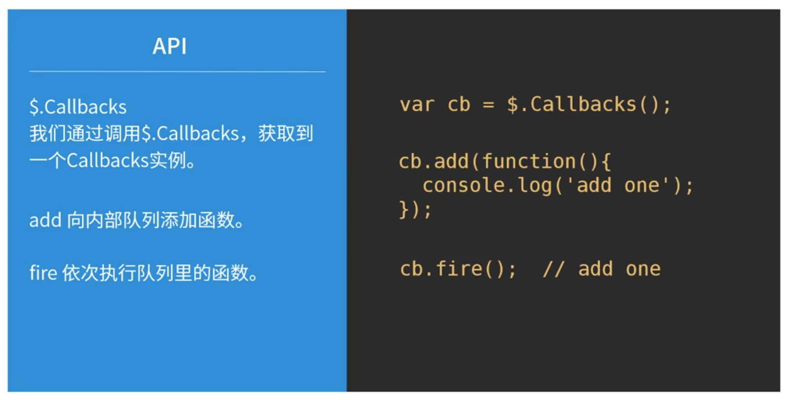

#Callbacks入门及原理分析
##Callbacks概念：

    1. $.Callback用于管理函数队列
    2. 通过add添加处理函数到队列中，通过fire去执行这些处理函数
    Note:$Callbacks是在jquery内部使用的，如为$.ajax,$.Deferred等组件提供基础功能的函数。
    它也可以用在类似功能的一些组件中，如自己开发的组件
    
使用：

    

    $.Callback可以通过字符串参数的方式，支持4种特定的功能: once,unique,stopOnfalse,memory

<ul>
<li>once: 函数队列只执行一次</li>
    
    // 不添加任何参数
    var cb = $.Callbacks();
    cb.add(function() {
        console.log('add');
    });

    cb.fire();      //add
    cb.fire();      //add

    // 添加参数'once'
    var cb = $.Callbacks('once');
    cb.add(function() {
        console.log('add');
    });

    cb.fire();      //add
    cb.fire();
    

<li>unique: 往内部队列添加的函数保持唯一，不能重复添加</li>

    // 不添加任何参数
    var cb = $.Callbacks();
    function demo() {
        console.log('demo');
    };

    cb.add(demo, demo);
    cb.fire();      //demo demo

    // 添加参数'once'
    var cb = $.Callbacks('unique');
    function demo() {
        console.log('demo');
    };

    cb.add(demo, demo);
    cb.fire();      // demo

<li>stopOnfalse: 内部队列里的函数是依次执行的，当某个函数的返回值是false时，停止继续执行剩下的函数</li>