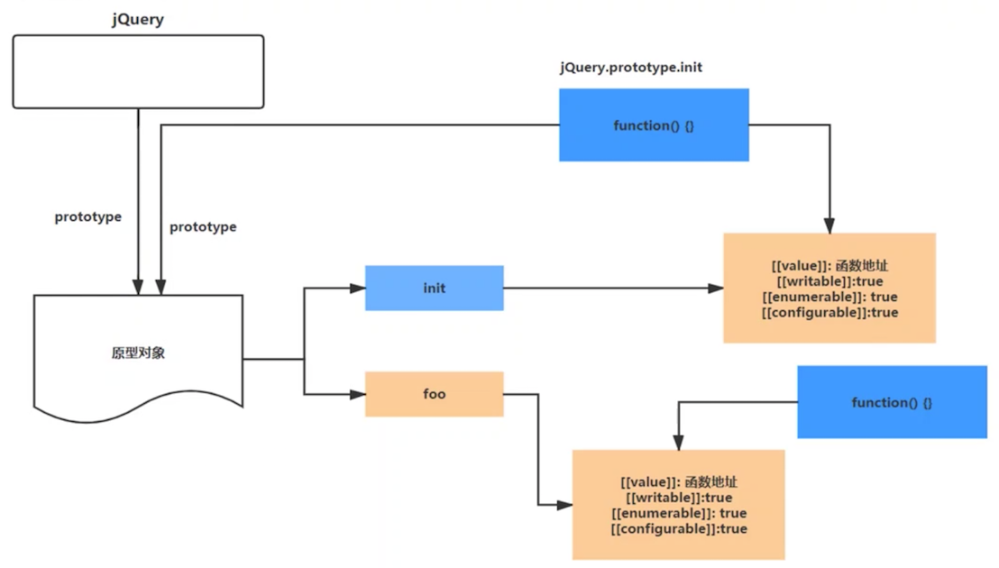

#jQuery整体架构-核心功能函数揭秘

##jQuery无new构建实例
###1、$就是jQuery的别称
实现： 

    (function (root) {
        var jQuery = function () {
        }
        root.$ = root.jQuery = jQuery;
    })(this)

###2、$()就是在创建jQuery的实例对象
实现：

    (function (root) {
        var jQuery = function () {
            return new jQuery();
        }
        root.$ = root.jQuery = jQuery;
    })(this)

Note: 我们知道创建对象实例需要用new关键字，用new关键字主要做了以下操作：创建新的Object对象；执行构造函数；将this指向新的Object；返回新的Object。但是我们看上线的代码，调用\$()，会无限的创建新的{}和执行构造函数。那么怎么解决调用\$()返回新的jQuery实例对象的，jQuery使用了共享原型对象方式。

----

##共享原型设计

    

实现：

    (function (root) {
        var jQuery = function () {
            return new jQuery.prototype.init();
        }
        jQuery.fn = jQuery.prototype = {        //jQuery.fn是jQuery.prototype的引用
            init: function () {

            }
        }
        // 共享原型对象
        // jQuery.prototype.init.prototype = jQuery.prototype;
        jQuery.fn.init.prototype = jQuery.fn;
        root.$ = root.jQuery = jQuery;
    })(this)

Note: 给jQuery设置原型对象prototype，在原型对象上挂在init方法，然后将init方法的原型指向jQuery的原型。最终在调用\$()的时候返回jQuery.prototype.init的实例对象。
打印\$():

    init {}

----
##extend源码解析

jQuery的extend方法允许我们给jQuery本身进行扩展；允许给jQuery的实例对象进行扩展，即可以通过以下两种方法使用jQuery的extend方法：\$.fn.extend、$.extend

    // 任意对象扩展
    var obj = $.extend(true,{}, ret, res);

    // jQuery本身扩展  this  ==  jQuery
    $.extend({
    	work: function(){}
    });
    
    jQuery.work();
    
    // jQuery实例对象扩展    this ->  实例对象   
    $.fn.extend({
        sex:"男"
    });
    $().sex;    //男     $.fn.extend   $.extend

原理如下：jQuery的原型jQuery.fn和jQuery都指向同一个匿名函数，都拿到的是extend函数的引用

    jQuery.fn.extend = jQuery.extend = function () {
        
    }

然后分析jQuery.extend()的源码：
浅拷贝和深拷贝：浅拷贝只做替换，深拷贝进行合并

    jquery.fn.extend = jQuery.extend = function () {
        // 货去第一个参数，若没传，则赋值为{}
        var target = arguments[0] || {};
        // 获取参数的个数，判断扩展方式
        var length = arguments.length;
        var i = 1;
        var deep = false;
        var option, name, copy, src, copyIsArray, clone;

        if (typeof target === 'boolean') {
            deep = target;
            target = arguments[1];
            i = 2;
        }

        // 判断第一个参数是否为真正的对象，因为第一个参数必须为对象，若不是，则赋值为{}
        if (typeof target !== 'object') {
            target = {}; 
        }

        // 给jQuery或者jQuery.fn扩展属性和方法
        if (length === i) {
            // this指向jQuery或者jQuery.fn或者任意的参数对象
            target = this;
            i--;
        }

        // 从参数下标为1开始，跳过第一个参数对象（被扩展对象），只循环第二个及以上参数对象即可
        // 浅拷贝 深拷贝
        for (; i < length; i++) {
            // arguments[i])可能为undefined或者null，用==即可
            if ((option = arguments[i]) != null) {
                for (name in option) {
                    // target[name] = option.name;
                    copy = option.name;
                    src = target[name];
                    // 深拷贝
                    if (deep && (jQuery.isPlainObject(copy) || (copyIsArray = jQuery.isArray(copy)))) {
                        if (copyIsArray) {
                            copyIsArray = false;
                            clone = src && jQuery.isArray(src) ? src : [];
                        } else {
                            clone = src && jQuery.isPlainObject(src) ? src : {};
                        }
                        target[name] = jQuery.extend(deep, clone, copy);
                    } else if (copy != undefined) {
                        // 浅拷贝
                        target[name] = copy; 
                    }
                }
            } 
        }
        return taget;
    }

    // 给jQuery.extend扩展方法
    jQuery.extend({
        // 类型检测
        isPlainObject: function () {
            return toString.call(obj) === "[object Object]";
        },
        is Array: function () {
            return toString.call(obj) === "[object Array]";
        }
    })