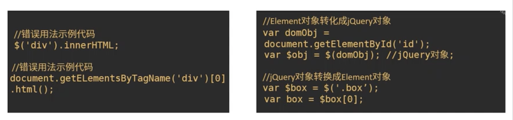
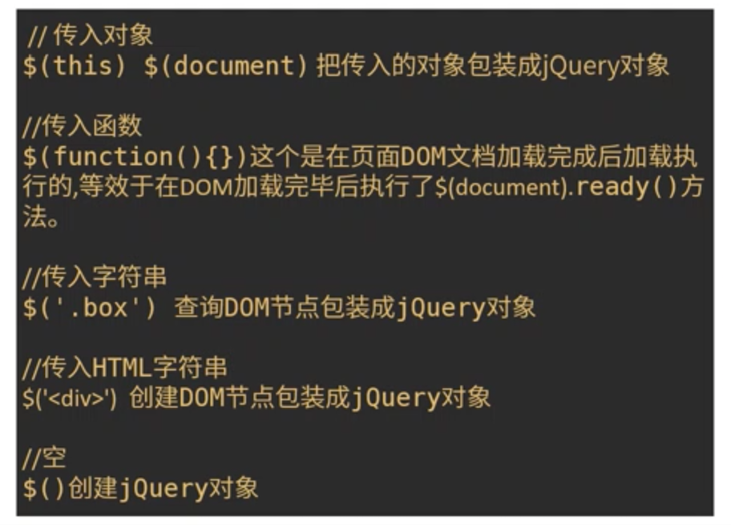

#jQuery选择器和DOM对象

##DOM与jquery dom对象

    

##jQuery错误用法与对象转换

    

##常用jQuery选择器接口

    

##选择器接口源码解析

html:

    

js:

    (function (root) {
        var rootjQuery;
        var rejectExp = /^<(\w+)\s*\/?>(?:<\/\1>|)$/;
        var jQuery = function (selector, context) {
            return new jQuery.prototype.init(selector, context);
        }

        jQuery.fn = jQuery.prototype = {
            length: 0,
            selector: "",
            init: function (selector, context, root) {
                context = context || document;
                var match, elem, index = 0;
                //$()  $(undefined)  $(null) $(false) 方式调用的话，返回jQuery实例
                if (!selector) {
                    return this;
                }

                root = root || rootjQuery;

                // $("<a>")创建DOM方式调用
                if (typeof selectot === 'string') {
                    if (selector.charAt[0] === '<' && selector.chartAt[selector.length - 1] === '>' && selector.length >= 3) {
                        // 将selector包装成数组返回给match
                        match = [selector];
                    }
                    // 创建DOM
                    if (match) {
                        // 在当前jQuery实例（即this）上merge selector
                        jQuery.merge(this, jQuery.parseHTML(selector, context));
                    } else {    // 查询DOM节点
                        elem = document.querySelectorAll(selector);
                        // DOM类数组转为真正数组
                        var elems = Array.prototype.slice.call(elem);
                        // 当前实例对象的length设置为查询到的DOM元素的length
                        this.length = elems.length;
                        for (; index < elems.length; index++) {
                            // 将DOM挨个复制到this上
                            this[index] = elems[index];
                        }
                        // 设置上下文对象和选择器名称
                        this.context = context;
                        this.selector = selector;
                    }
                } else if (selector.nodeType) {     // 传入window\document等有nodeType的dom对象
                    // 设置this的上下文以及this[0]
                    this.context = this[0] = selector;
                    this.length = 1;
                    return this;
                } else if (jQuery.isFunction(selector)) {   // 传入函数
                    // 若当前作用域有ready()方法，则传入该函数给ready()，否则立即执行
                    return root.ready !== undefined ? root.ready(selector) : selector(jquery);
                }
            }
        }

        jQuery.fn.init.prototype = jQuery.fn;

        jQuery.extend = jQuery.prototype.extend = function () {
            // ...
        }

        jQuery.extend({
            // 类型检测
            isPlainObject: function (obj) {},
            
            isArray: function (obj) {},

            isFunction: function (fn) {
                return toString.call(fn) === '[object Function]';
            },
            //合并数组
            merge: function (first, second) {
                var i = first.length,
                    l = second.length,
                    j = 0;
                    
                if (typeof l === 'number') {
                    for (; j < l; j++) {
                        first[i++] = second[j];
                    }
                } else {
                    while (second[j] !== undefined) {
                        first[i++] = second[j++];
                    }
                }

                first.length = i;

                return first;
            },
            
            parseHTML: function (data, context) {
                if (!data || typeof data !== 'string') {
                    return null;
                }
                // 过滤掉'<'以及'>'，将字符串“<a>”转为“a”
                var parse = rejectExp.exec(data);
                return [context.createElement(parse[1])];
            }
        });
    })(this);

根据rejectExp，分析其正则执行过程中如何进行过滤？包含哪些执行步骤？

    答：rejectExp掐头去尾后，分成两个部分：“<(\w+)\s*\/?>”和“(?:<\/\1>|)”。

    先说头和尾：
        ^：匹配输入字符串的开始位置，这里后面接<，表示匹配已<开头的字符。
        $：匹配输入字符串的结束位置，这里匹配“(?:<\/\1>|)”这一串。

    第一部分：<(\w+)\s*\/?>
        匹配的第一个字符是“<”,
        <：匹配<
        \w：匹配包括下划线的任何单词字符。等价于“[A-Za-z0-9_]”,
        +：匹配前面的子表达式一次或多次,
        \s：匹配任何空白字符，包括空格、制表符、换页符等等。等价于[ \f\n\r\t\v],
        *：匹配前面的子表达式零次或多次,
        \/：匹配/,
        ?：匹配前面的子表达式零次或一次,
        >：匹配>
    所以这一部分匹配<开头，以>结尾，中间衔接：一个或多个任何单词字符 + 零个或多个空白字符 + 零个或一个反斜杠。
    比如：<a>、<a  >、
、 、 、 等html标签。

    第二部分：(?:<\/\1>|)
        1、(pattern)：
            匹配 pattern 并获取这一匹配。所获取的匹配可以从产生的 Matches 集合得到，在VBScript 中使用 SubMatches 集合，在JScript 中则使用 0…0…9 属性。要匹配圆括号字符，请使用 '(' 或 ')'。
        2、(?:pattern)：
            匹配 pattern 但不获取匹配结果，也就是说这是一个非获取匹配，不进行存储供以后使用。这在使用 "或" 字符 (|) 来组合一个模式的各个部分是很有用。例如， 'industr(?:y|ies) 就是一个比 'industry|industries' 更简略的表达式。
        这两点引用：https://www.cnblogs.com/zzsdream/p/10941734.html
        3、‘\1’：
            匹配的是 所获取的第1个()匹配的引用。例如，’(\d)\1’ 匹配两个连续数字字符。如33aa 中的33
            ‘\2’：
            匹配的是 所获取的第2个()匹配的引用。
        这一点引用：https://blog.csdn.net/dlnu2015250622/article/details/90053256

        这里的\1表示第一部分的括号中的内容，即：(\w+)，第二部分可写为：(?:<\/(\w+)>|)

    总结：由以上三个可得知，第二部分可表示：第一部分 + <\/(\w+)>  或者  第一部分 + 空（因为第二部分中 | 后面没有匹配的字符），
    所以这个正则匹配的是一个html单标签或者html双标签。
    例如：、、

、 、 、 等html标签。

###1、如何把创建的DOM节点包装成jQuery对象
    通过context.createElement创建DOM节点保存在数组中，调用merge方法把数组中存储的DOM节点的成员添加到jQuery实例对象上。

###2、jQuery实例对象length属性的作用
    存储DOM节点的数组对象平滑地添加到jQuery实例对象上。

###3、merge方法的应用场景有哪些？
    1. 合并数组；
    2. 把数组成员合并在有length属性的对象上

###4、\$(document).ready()与\$(function(){})的关系 
    1. $(document).ready()是对document.DOMContentLoaded事件的封装
    2. $(function(){})每次调用$()传入的参数会收集在readyList数组中，当document.DOMContentLoaded事件触发依次执行readyList中收集到的处理函数