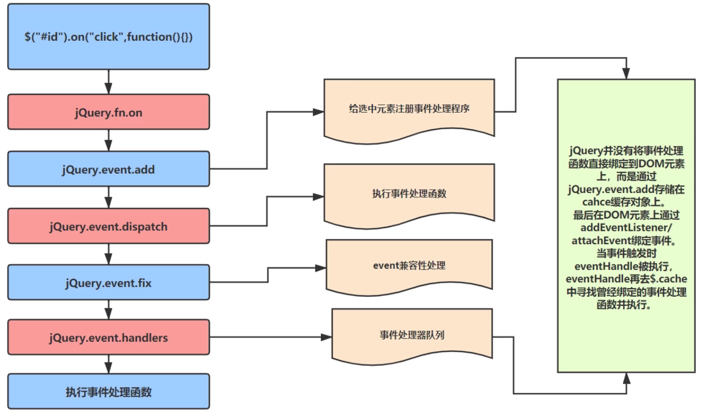

#事件绑定-bind\delegate\on

重点：on，bind已经delegate已经被on代替

事件模型
DOM0 DOM2级事件模型

DOM0级事件：

    1、通过JS指定事件处理程序的传统方式：就是将一个函数赋值给一个事件处理程序属性

DOM2级事件：

    1、2级DOM中增加定义了DOM事件模型的概念。
    2、“DOM2级事件”规定的事件流包括3个阶段：事件捕获阶段、处于目标阶段和事件冒泡阶段。首先发生的是事件捕获，然后处于目标阶段，最后才事件冒泡。
    3、定义了一个方法，用于处理指定事件处理程序：addEventListener
    它接受三个参数：处理的事件名称；事件处理程序；一个指定是在事件冒泡阶段还是事件捕获阶段处理的布尔值。
    true: 事件捕获阶段处理；false(默认)：事件冒泡阶段处理

事件流：

    
    

        说明：DOM2级事件规定的事件流包含三个阶段：事件捕获阶段、处于目标阶段、事件冒泡阶段。首先发生的事件捕获为截获事件提供机会，然后是实际的目标接收事件，最后一个阶段是事件冒泡阶段，可以在这个阶段对事件作出响应。
    

事件委托：

    利用事件冒泡，只指定一个事件处理程序来管理某一类型的所有事件。

为什么要用事件委托？

    提升整体运行性能。

事件委托原理：

    因为事件冒泡会冒泡到当前元素的父级元素上，可以使用事件委托来委托当前元素的父级代为执行事件。

###API:

####bind

    语法： $(selector).bind(event, data, function)
    定义和语法：
    bind方法为被选元素添加一个或多个处理程序，并规定事件发生时运行的函数。

####delegate

    语法： $(selector).delegate(child, event, data, function)
    定义和语法：
    delegate方法为被选元素的子元素，添加一个或多个处理程序，并规定事件发生时运行的函数。

####on

    语法： $(selector).on(child, event, data, function)
    定义和语法：
    on方法为被选元素以及子元素，添加一个或多个处理程序，并规定事件发生时运行的函数。自从1.7起，on为bind()和delegate()的替代品，推荐。

##on源码分析

###jQuery事件处理机制解决了哪些问题：

<ul>
    <li>不同浏览器下的事件兼容</li>
    <li>一个事件类型添加多个事件函数，一次添加多个事件类型的处理函数</li>
    <li>简介的定义方式</li>
    <li>允许自定义事件</li>
</ul>

##jQuery事件设计原型

    

